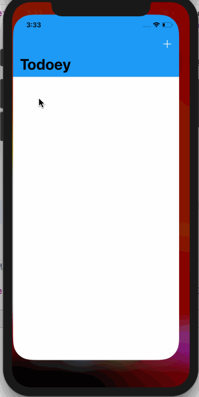

# Todoey
> To use Realm to persist Data in iOS.
This app keeps track of all your tasks.

[![Swift Version][swift-image]][swift-url]
  

## Features

- [x] Feature 1 - 
Swipable Cells using CocoaPods (SwipeCellKit)
- [x] Feature 2 -
Color framework using CocoaPods (ChameleonFramework)
- [x] Feature 3 -
Realm Database Local Persistence

## Requirements

- iOS 9.0+
- Xcode 11.5

## Installation

#### CocoaPods
You can use [CocoaPods](http://cocoapods.org/) to install 

'Chameleon Framework'
'Realm'
'SwipeCellKit'

## Meta

[https://github.com/ebosompa/github-link](https://github.com/ebosompa/)

[swift-image]:https://img.shields.io/badge/swift-3.0-orange.svg
[swift-url]: https://swift.org/
[license-image]: https://img.shields.io/badge/License-MIT-blue.svg
[license-url]: LICENSE
[travis-image]: https://img.shields.io/travis/dbader/node-datadog-metrics/master.svg?style=flat-square
[travis-url]: https://travis-ci.org/dbader/node-datadog-metrics
[codebeat-image]: https://codebeat.co/badges/c19b47ea-2f9d-45df-8458-b2d952fe9dad
[codebeat-url]: https://codebeat.co/projects/github-com-vsouza-awesomeios-com

